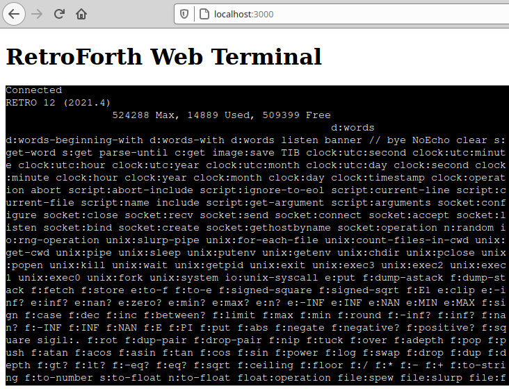

# RetroForth Web Terminal

Run a Retroforth session in a docker container, in a browser, over websockets.



## USE A FIREWALL!

This is a huge security risk on untrusted networks. Anyone accessing http://localhost:3000 can run arbitrary Forth commands. You probably don't want to run this on a public server without first changing a few things.

## Why?

I'm running some experiments and eventually want to add some nice features like tab completion, history, browsing, etc.

## Install

You will need to [install Docker Compose](https://docs.docker.com/compose/install/) before running this.

## Run

```
sudo docker-compose up
```

## Use

visit  http://localhost:3000

## Customize

`websocketd` and `retro`
